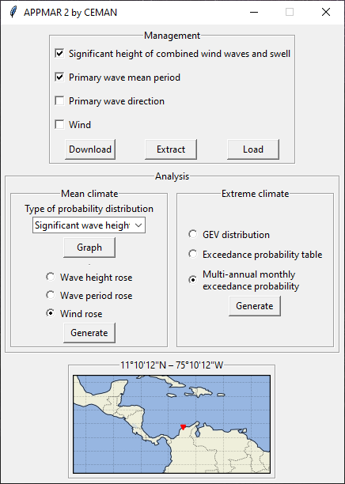

# APPMAR 2

APPMAR 2 is a Python program for marine climate analysis.



Some features:

* Download data from WAVEWATCH III® 30-year Hindcast Phase 2 in GRIB2 format.
* Extract time series at given coordinates and save data to CSV format.
* Load time series in CSV format.
* Perform mean and extreme climate graphical analyses over loaded data series.
* Show interactive statistical plots and allow the user to save them as 300-dpi PNG images.

## Installation

For installation on Windows, open Anaconda Prompt and run the following commands:

1. Install dependencies:

```
conda install -y -c conda-forge pandas>=1.0.3 numpy>=1.18.1 xarray>=0.15.1 matplotlib>=3.1.3 seaborn>=0.10.0 statsmodels>=0.11.0 cartopy>=0.17.0 cfgrib>=0.9.8.1
```

2. Install APPMAR 2:

```
pip install pygubu appmar2
```

## Run

After installation, run the command `appmar2` on Anaconda Prompt.

## Authors

* German Rivillas-Ospina
* Diego Casas
* Dennis Rudas
* Katherine Rivera
